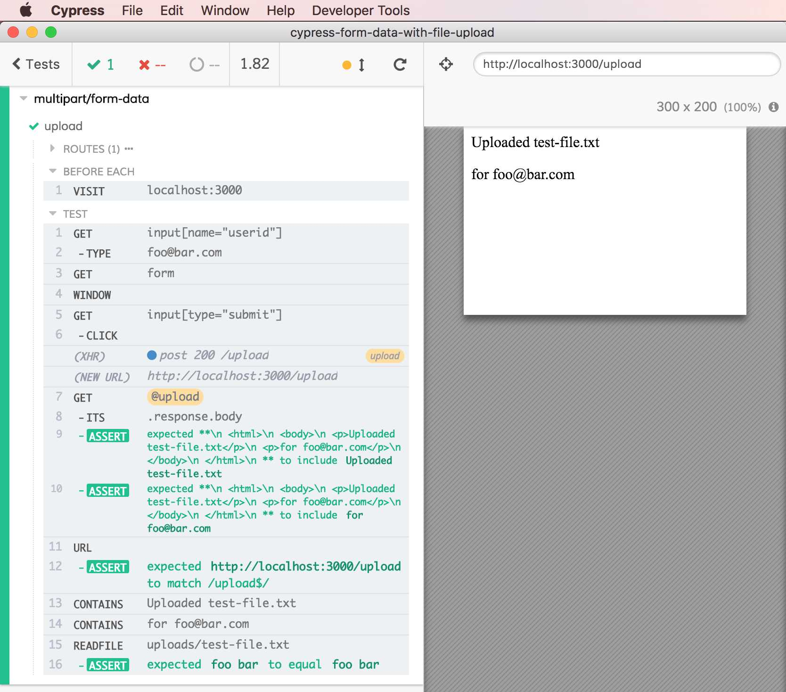

# cypress-form-data-with-file-upload

[![NPM][npm-icon] ][npm-url]

[![Build status][ci-image] ][ci-url]
[![semantic-release][semantic-image] ][semantic-url]

> How to test HTTP form submission with file input using Cypress - a hack

Testing multipart file upload in Cypress

If the app uses "naked" HTML form submission with file input like [server/index.html](server/index.html), the Cypress test [spec.js](cypress/integration/spec.js) can either replace the submission on the fly with XHR.

## Hack

This is a solution implemented with what is possible today using JavaScript and Cypress 1.4.1. Of course using native events would be better than this hack - but that work needs to be done [#311](https://github.com/cypress-io/cypress/issues/311). This code might be a termporary answer to people who are blocked by file upload in [#170](https://github.com/cypress-io/cypress/issues/170)

## Install

```
npm install --save-dev cypress-form-data-with-file-upload
```

## Use

From your spec file (see [spec.js](cypress/integration/spec.js) in this repo)

```js
const attachFiles = require('cypress-form-data-with-file-upload')
beforeEach(() => {
  cy.visit('localhost:3000')
})
it('uploads', () => {
  // files to upload for each input[type="file"] by name
  // we are going to construct a single text file in this test
  // for <input type="file" name="fileToUpload" />
  const files = {
    fileToUpload: new File(['foo bar'], 'test-file.txt', {
      type: 'text/plain'
    })
  }
  // get the form element and attach files to upload
  cy.get('form').then(attachFiles(files))

  // submit the form
  cy.get('input[type="submit"]').click()

  // check returned page
  // or check url
  // or spy on the XHR form submission
})
```

**Tip:** you can spy on the XHR call, see test in [spec.js](cypress/integration/spec.js)



## Development

- `npm install`
- start server [index.js](index.js) with `npm start`
- open Cypress `npm run cy:open`

### Small print

Author: Gleb Bahmutov &lt;gleb.bahmutov@gmail.com&gt; &copy; 2018

* [@bahmutov](https://twitter.com/bahmutov)
* [glebbahmutov.com](https://glebbahmutov.com)
* [blog](https://glebbahmutov.com/blog)

License: MIT - do anything with the code, but don't blame me if it does not work.

Support: if you find any problems with this module, email / tweet /
[open issue](https://github.com/bahmutov/cypress-form-data-with-file-upload/issues) on Github

## MIT License

Copyright (c) 2018 Gleb Bahmutov &lt;gleb.bahmutov@gmail.com&gt;

Permission is hereby granted, free of charge, to any person
obtaining a copy of this software and associated documentation
files (the "Software"), to deal in the Software without
restriction, including without limitation the rights to use,
copy, modify, merge, publish, distribute, sublicense, and/or sell
copies of the Software, and to permit persons to whom the
Software is furnished to do so, subject to the following
conditions:

The above copyright notice and this permission notice shall be
included in all copies or substantial portions of the Software.

THE SOFTWARE IS PROVIDED "AS IS", WITHOUT WARRANTY OF ANY KIND,
EXPRESS OR IMPLIED, INCLUDING BUT NOT LIMITED TO THE WARRANTIES
OF MERCHANTABILITY, FITNESS FOR A PARTICULAR PURPOSE AND
NONINFRINGEMENT. IN NO EVENT SHALL THE AUTHORS OR COPYRIGHT
HOLDERS BE LIABLE FOR ANY CLAIM, DAMAGES OR OTHER LIABILITY,
WHETHER IN AN ACTION OF CONTRACT, TORT OR OTHERWISE, ARISING
FROM, OUT OF OR IN CONNECTION WITH THE SOFTWARE OR THE USE OR
OTHER DEALINGS IN THE SOFTWARE.

[npm-icon]: https://nodei.co/npm/cypress-form-data-with-file-upload.svg?downloads=true
[npm-url]: https://npmjs.org/package/cypress-form-data-with-file-upload
[ci-image]: https://travis-ci.org/bahmutov/cypress-form-data-with-file-upload.svg?branch=master
[ci-url]: https://travis-ci.org/bahmutov/cypress-form-data-with-file-upload
[semantic-image]: https://img.shields.io/badge/%20%20%F0%9F%93%A6%F0%9F%9A%80-semantic--release-e10079.svg
[semantic-url]: https://github.com/semantic-release/semantic-release
